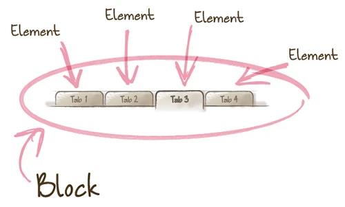
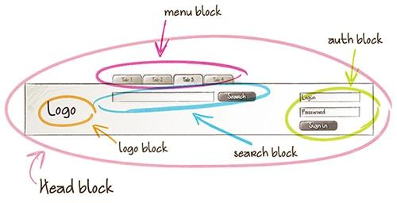

# CSS / Sass Styleguide

*CSS and Less 开发实践*

## Table of Contents

1. [Terminology](#terminology)
    - [Rule Declaration](#rule-declaration)
    - [Selectors](#selectors)
    - [Properties](#properties)
1. [CSS](#css)
    - [Formatting](#formatting)
    - [Comments](#comments)
    - [OOCSS and BEM](#oocss-and-bem)
    - [ID Selectors](#id-selectors)
    - [JavaScript hooks](#javascript-hooks)
    - [Border](#border)
1. [Sass](#sass)
    - [Import](#Import)
    - [Mixins](#Mixin)
    - [Avoid nested selectors](#Avoid-nested-selectors)
    - [Variables](#Variables)

## Terminology

### Rule declaration

"规则声明"是赋予一个选择器(或一组选择器)及其附带的一组属性的名称,例如:

  ```css
  .listing {
      font-size: 18px;
      line-height: 1.2;
  }
  ```

### Selectors

选择器的举例:

  ```css
  .my-element-class {
      /* ... */
  }

  [aria-hidden] {
      /* ... */
  }
  ```

### Properties

属性为规则声明的选定元素提供样式。 属性是键-值对，规则声明可以包含一个或多个属性声明。 属性声明示例如下:

  ```css
  /* some selector */ {
      color: #333;
      background: #f1f1f1;
  }
  ```

**[⬆ back to top](#table-of-contents)**

## CSS

### Formatting

- 缩进使用4个空格 (4 spaces).
- 类命名使用`-`间隔单词, 不要使用驼峰.
  - 如果使用BEM, 则 下划线 和 PascalCase(大驼峰) 模式也可以 (see [OOCSS and BEM](#oocss-and-bem) below).
- 尽量不要使用ID选择器.
- 多个选择器同时作用时, 给每个选择器独立一行.
- 在大括号 `{` 之前保留一个空格.
- 在属性中，在':'字符后面放一个空格.
- 闭合括号 `}` 另起一行.
- 在"规则声明"之间放置空行.

**Bad**

  ```css
  .avatar{
      border-radius:50%;
    border:2px solid #fff;}
  .no, .nope, .not_good {
      // ...
  }
  #lol-no {
    // ...
  }
  ```

**Good**

  ```css
  .avatar {
      border-radius: 50%;
      border: 2px solid #fff;
  }

  .one,
  .selector,
  .per-line {
    // ...
  }
  ```

### Comments

- 更建议使用行注释 (`//`), 而不是块注释.
- 注释独立一行, 而不是跟在注释内容之后.
- 注释尽量详尽, 尤其一些特殊含义的属性:
  - z-index
  - 浏览器兼容性内容 或浏览器特定的 hacks

### OOCSS and BEM

我鼓励OOCSS和BEM的结合，原因如下:

- 有助于在CSS和HTML之间建立清晰、严格的关系
- 有助于创建可重用、可组合的组件
- 减少嵌套以及更低的特异性
- 它有助于构建可伸缩的样式表

**OOCSS**, 面向对象的CSS，是由Nicole Sullivan提出的css理论，其主要的两个原则是：Separate structure and skin（分离结构和主题）/ Separate container and content（分离容器和内容）

- Nicole Sullivan's [OOCSS wiki](https://github.com/stubbornella/oocss/wiki)
- Smashing Magazine's [Introduction to OOCSS](http://www.smashingmagazine.com/2011/12/12/an-introduction-to-object-oriented-css-oocss/)

**BEM**, BEM通过Block、Element、Modifier来描述页面。

Block是页面中独立存在的区块，可以在不同场合下被重用。每个页面都可以看做是多个Block组成。



Element是构成Block的元素，只有在对应Block内部才具有意义，是依赖于Block的存在。



Modifier是描述Block或Element的属性或状态。同一Block或Element可以有多个Modifier。

这三部分结合在一起，可以体现在class命名上，从而为开发者提供更友好、更有意义的css组织方式。其形式是：

  ```css
  .block { }
  .block_modifier { }
  .block__element { }
  .block__element-modifier { }
  ```

- CSS Trick's [BEM 101](https://css-tricks.com/bem-101/)
- Harry Roberts' [introduction to BEM](http://csswizardry.com/2013/01/mindbemding-getting-your-head-round-bem-syntax/)

**Example**

  ```jsx
  // ListingCard.jsx
  function ListingCard() {
      return (
          <article class="listing-card listing-card_featured">
              <h1 class="listing-card__title">Adorable 2BR in the sunny Mission</h1>
              <div class="listing-card__content">
                  <p>Vestibulum id ligula porta felis euismod semper.</p>
              </div>
          </article>
      );
  }
  ```

  ```css
  /* ListingCard.css */
  .listing-card { }
  .listing-card_featured { }
  .listing-card__title { }
  .listing-card__content { }
  ```

- `.listing-card` 这是Block
- `.listing-card___title`和`listing-card__content` 是element
- `.listing-card_featured` 这是modifier

### ID selectors

虽然可以在CSS中通过ID选择元素，但通常应将其视为一种反模式. ID 选择器引入了选择器之间很大的特异性 [specificity](https://developer.mozilla.org/en-US/docs/Web/CSS/Specificity) 而且它们是不可重用的.

了解更多, 请看一下 [CSS Wizardry's article](http://csswizardry.com/2014/07/hacks-for-dealing-with-specificity/) 关于处理特异性.

### JavaScript hooks

避免在CSS和JavaScript中绑定到同一个类名称(class). 将这两者合并在一起，至少会浪费重构期间的时间，因为开发人员必须交叉引用他们要更改的每个类，而且开发人员因为担心破坏功能而害怕进行更改

建议创建特定于javascript的类来绑定，并添加前缀 `.js-`:

  ```html
  <button class="btn btn-primary js-request-to-book">Request to Book</button>
  ```

### Border

使用 `0` 而不是 `none` 来指定一个 `style` 没有边框(no border).

**Bad**

  ```css
  .foo {
      border: none;
  }
  ```

**Good**

  ```css
  .foo {
      border: 0;
  }
  ```

**[⬆ back to top](#table-of-contents)**

## Less

less 是动态的样式表语言，通过简洁明了的语法定义，使编写 CSS 的工作变得非常简单。

### Import

@import 语句引用的文需要写在一对引号内，.less 后缀不得省略.

  ```less
  /* Not recommended */
  @import "mixins/size";
  @import 'mixins/grid.less';

  /* Recommended */
  @import "mixins/size.less";
  @import "mixins/grid.less";
  ```

### Mixin

  1. 在定义 mixin 时，如果 mixin 名称不是一个需要使用的 className，必须加上括号，否则即使不被调用也会输出到 CSS 中。

  1. 如果混入的是本身不输出内容的 mixin，需要在 mixin 后添加括号（即使不传参数），以区分这是否是一个 className。

  ```less
  /* Not recommended */
  .big-text {
      font-size: 2em;
  }

  h3 {
      .big-text;
      .clearfix;
  }

  /* Recommended */
  .big-text() {
      font-size: 2em;
  }

  h3 {
      .big-text(); /* 1 */
      .clearfix(); /* 2 */
  }
  ```

### Avoid nested selectors

  将嵌套深度限制在 3 级。对于超过 4 级的嵌套，给予重新评估。这可以避免出现过于详实的 CSS 选择器。
  避免大量的嵌套规则。当可读性受到影响时，将之打断。推荐避免出现多于 20 行的嵌套规则出现

  ```less
  // bad
  .main{
      .title{
          .name{
              color:#fff
          }
      }
  }

  // good 
  .main-title{
    .name{
        color:#fff
    }
  }
  ```

### Variables

推荐使用 dash-cased 命名变量 (比如 `@my-variable`).

**[⬆ back to top](#table-of-contents)**
